# JavaScript Quiz Laboratory Activity
A simple interactive quiz app featuring a timer, progress bar, animations, and localStorage-based high score tracking.

## 📸 Result preview

  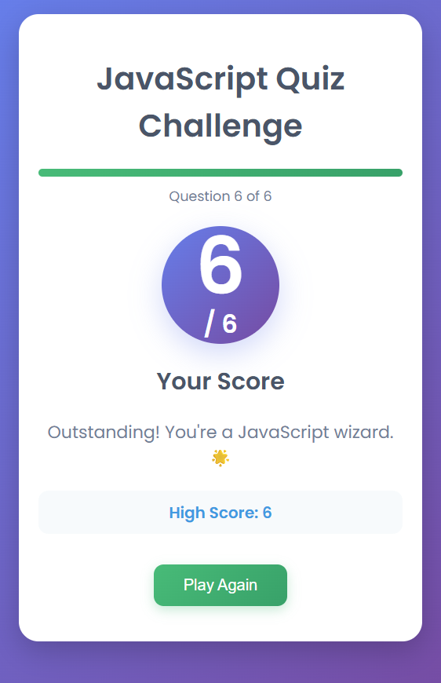

## 📸 Result Preview (Different Screens)

  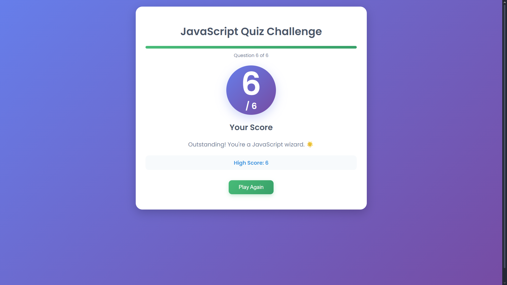
  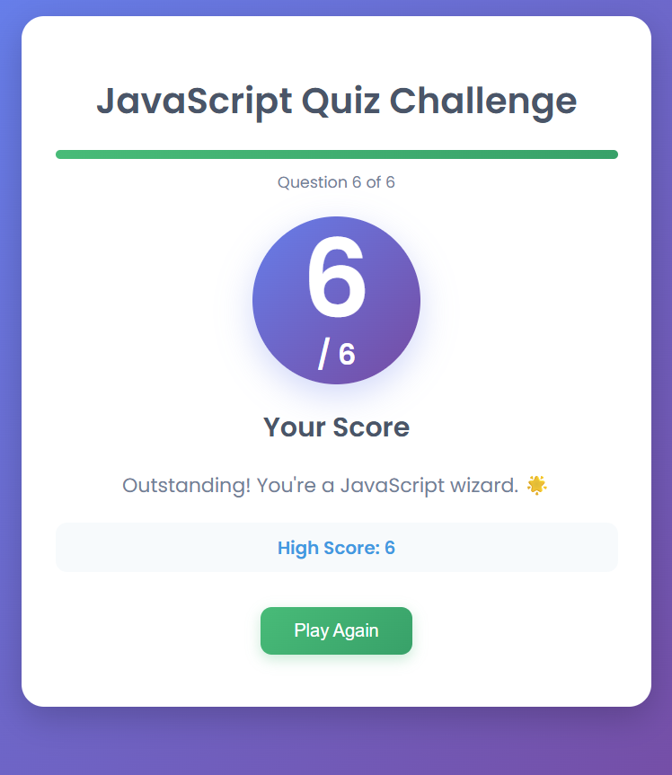

---

## 📸 Different Results Feedback

**1/6 Score Result**

  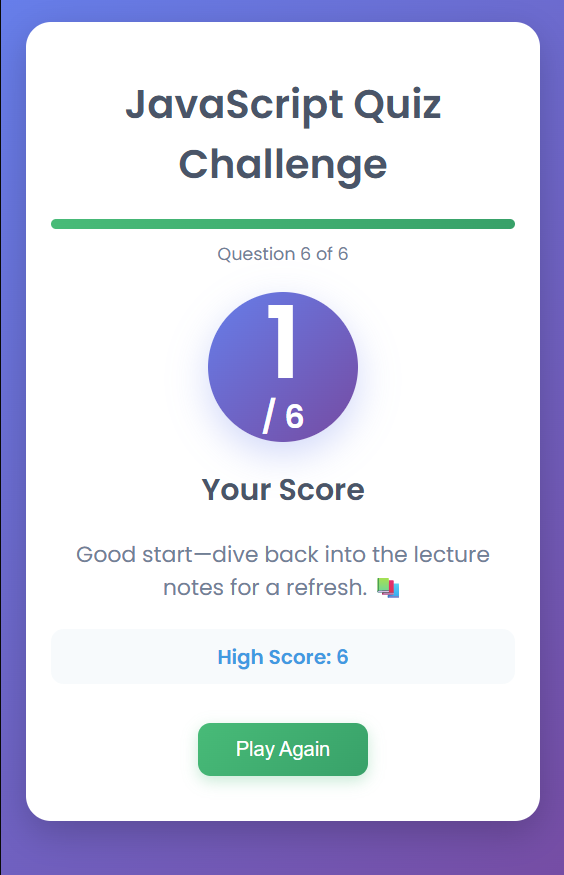

**3/6 Score Result**

  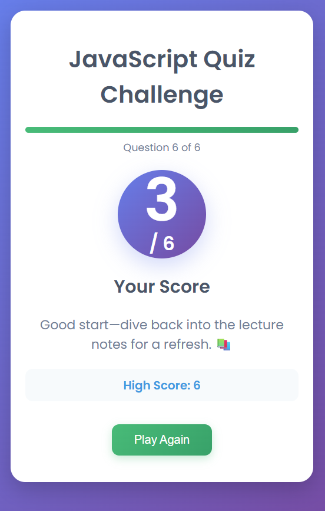

**4/6 Score Result**

  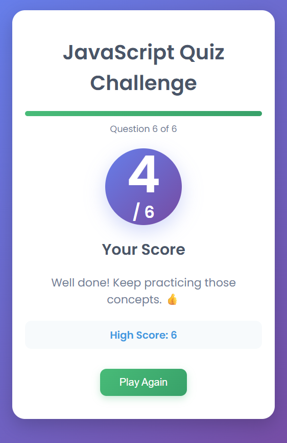

**6/6 Score Result**

  

---

## 📸 Buttons and Options + Hover Effects

**Next Question (Not Hovered)**

  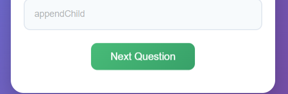

**Try Again & Next Question (Hovered)**

  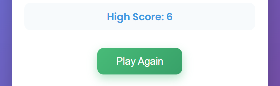
  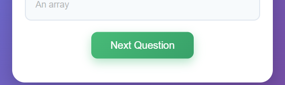

---

## 📸 Quiz Options, Timer, and Progress Bar

**Default View**

  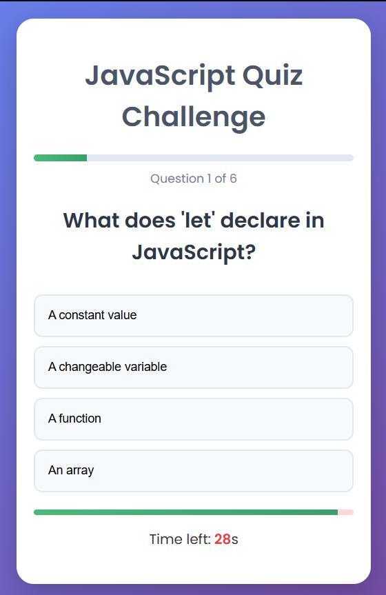

**Option Hovered**

  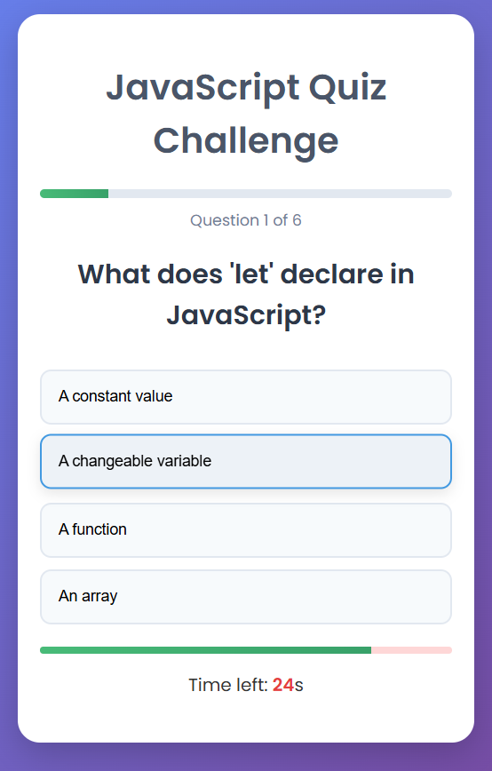

**Correct Answer Selected**

  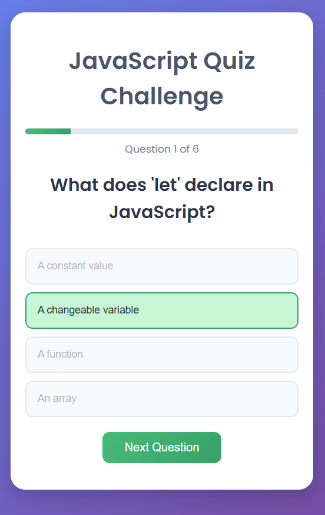

**Wrong Answer Selected**

  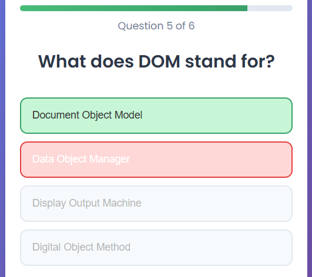

